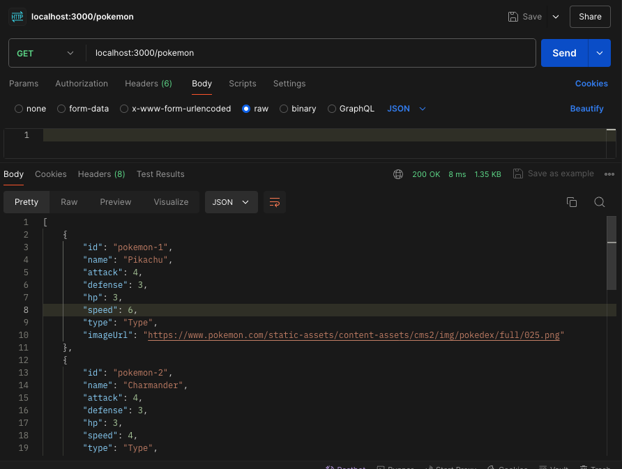

# Proyecto Fullstack con React, NestJS y Sequelize

Este repositorio contiene una aplicación fullstack de pokemones, con un frontend desarrollado en React y un backend en NestJS, utilizando Sequelize para la gestión de la base de datos.

## Prerrequisitos

- Node.js: Tener Node.js instalado en el sistema.

## Estructura del Proyecto

El proyecto está organizado en dos carpetas principales:

- client: Contiene el proyecto frontend construido con React.
- server: Contiene el proyecto backend desarrollado con NestJS.

## Backend:

### Navegar a la carpeta del servidor

```bash
cd server
```

### Instalar dependencias

Ejecuta el siguiente comando para instalar todas las dependencias del proyecto:

```bash
npm install
```

### Generar la primera migración de la base de datos

Ejecuta el comando para generar la migración inicial:

```bash
npm run migration:generate
```

Esto creará una carpeta database en la raíz del proyecto, que contendrá las migraciones con timestamp y el archivo database.sqlite que almacenará la base de datos.

### Ejecutar las migraciones

Para aplicar las migraciones y crear las tablas correspondientes en la base de datos, ejecuta:

```bash
npm run migration:run
```

### Levantar el servidor en modo desarrollo

Inicia el servidor de desarrollo con:

```bash
npm run start:dev
```

Esto levantará el servidor en el puerto 3000.

### Cargar datos iniciales (Seed de Pokemons)

Realiza una solicitud GET a la siguiente ruta para cargar datos iniciales en la base de datos:

```bash
GET http://localhost:3000/seed
```

Esto poblará la base de datos con los datos de los Pokémon.

### Obtener la lista de Pokémons

Puedes obtener la lista de Pokémon almacenados haciendo una solicitud GET a:

```bash
GET http://localhost:3000/pokemon
```



## Frontend: Primeros Pasos

### Navegar a la carpeta del cliente

```bash
cd client
```

### Instalar dependencias

Ejecuta el siguiente comando para instalar todas las dependencias del proyecto:

```bash
npm install
```

### Correr la aplicación frontend

Levanta el proyecto frontend con:

```bash
npm run dev
```

Accede a la aplicación desde tu navegador en la siguiente URL: [http://localhost:5173/](http://localhost:5173/)

Seleccionar un pokemon de la lista y empezar a batallar con el botón de "Start battle".


Happy coding!

Hecho con ❤️ por Ignacio Soler.